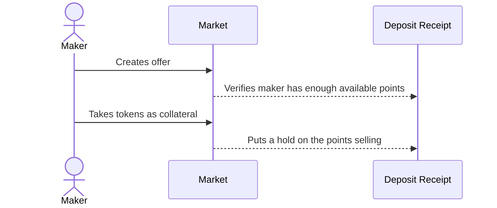
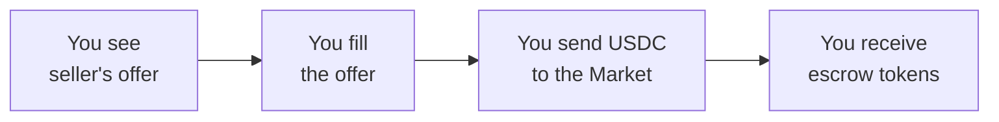
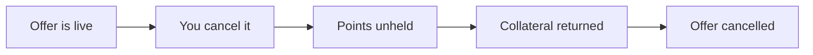
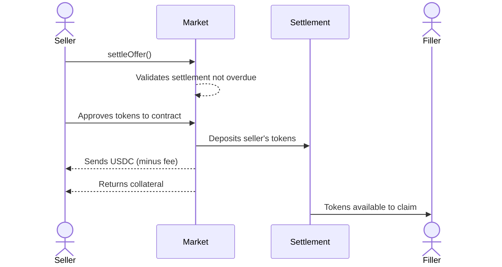
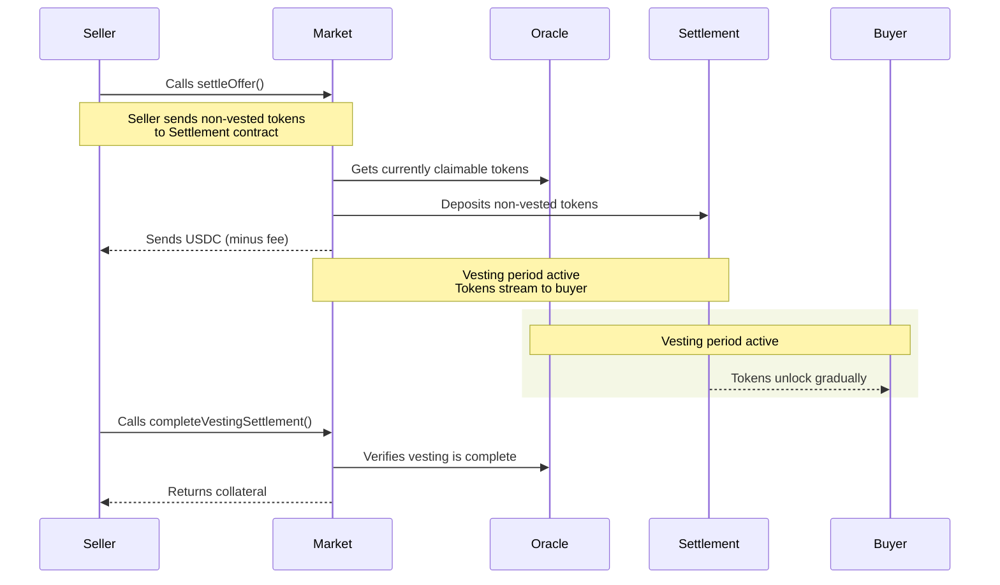
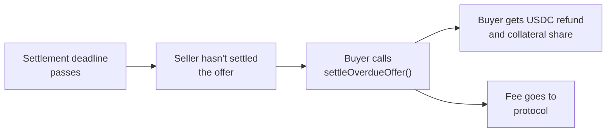

# Market Trading

The Market contract is a decentralized order book for buying and selling escrow tokens (tokenized
points) before TGE. It also handles the conversion of escrow tokens to actual tokens after TGE.

## How Offers Work

### What is an Offer?

An offer is a binding commitment to trade points at a specific price with collateral backing.

**Example**: "I'll sell you 500 of my points for 50 USDC, and I'm putting up 50 USDC as collateral
to guarantee this deal."

Of course we are not limited to using collateral as a guarantee, we can use offchain agreements
(legal contracts) or credit scores as well, this is totally up to the discretion of the seller.

### Collateral

There are many different types of collateral that can be used to back an offer. We will discuss
liquid tokens such as USDC from now. However, sellers are not limited to using collateral tokens and
can use offchain agreements or credit scores as well. When creating an offer, the seller puts up a
configurable amount of collateral. This collateral is held in escrow until the offer is settled, or
the offer is cancelled.

### Offer Status

| Status                     | Description                                                                                        |
| -------------------------- | -------------------------------------------------------------------------------------------------- |
| OFFER_CREATED              | The offer is new and waiting for buyers to fill it.                                                |
| OFFER_FILLED_PARTIAL       | The offer has been partially filled by one or more buyers, with more supply remaining.             |
| OFFER_FILLED               | The offer is completely filled by buyers.                                                          |
| OFFER_SETTLED              | The offer has been settled with tokens provided to the Settlement contract for buyers to claim.    |
| OFFER_SETTLED_WITH_VESTING | The offer has been settled but has a vesting schedule. Tokens unlock gradually over time.          |
| OFFER_CANCELLED            | The offer was cancelled by the maker before any fills, and collateral was returned.                |
| OFFER_OVERDUE_SETTLED      | The settlement deadline passed without the seller settling. Buyers claimed refunds and collateral. |

### Creating a Sell Offer

All offers include the the amount of points to sell, the price, the collateral token, and the
collateral amount. And all offers are able to be cancelled with the collateral returned (minus a
cancellation fee if defined), as long as there are no existing fills yet.

<Note>
  {" "}
  You must have a valid deposit receipt NFT with enough available points to create an offer.{" "}
</Note>

### Filling an Offer

When you see an offer you want to accept, you fill it as a buyer:

To fill an offer, you need USDC equal to the offer price. When you fill an offer, you send the USDC
to the `Market.sol` contract. You instantly receive escrow tokens minted 1:1 to the points. The
seller doesn't receive the USDC until settlement when they provide the escrow tokens. The seller's
collateral is only returned upon successful settlement.

<Danger>Once an offer is filled, both the maker and filler cannot cancel or reverse it.</Danger>

### Partial Fills

Offers can be filled multiple times if there's enough supply. This means multiple buyers can
participate in the same offer, each getting a share of the points without the seller needing to
create separate offers.

Consider this example: A seller creates an offer for 1000 points for 100 USDC. Three buyers fill it
partially over time:

| Step | Buyer   | Amount  | Price   | Remaining | Status           |
| ---- | ------- | ------- | ------- | --------- | ---------------- |
| 1    | Buyer 1 | 400 pts | 40 USDC | 600 pts   | PARTIALLY FILLED |
| 2    | Buyer 2 | 300 pts | 30 USDC | 300 pts   | PARTIALLY FILLED |
| 3    | Buyer 3 | 300 pts | 30 USDC | 0 pts     | FILLED           |

The seller collects 100 USDC total but reaches three different buyers without creating separate
offers.

### Cancelling Offers

You can cancel an offer if no one has filled it yet:

When you cancel an offer, your held points return to available so you can use them elsewhere. Your
collateral is returned to you, and the offer becomes inactive.

You can only cancel an offer if it hasn't been filled at all. Once someone fills even part of it,
you can't cancel anymore. If there's a cancellation fee configured, it will be deducted from your
returned collateral.

### Shortfall of Points

Points balances may unexpectedly change after an offer is created. If a seller's points decrease,
they may not have enough points to fulfill all their offers. In this case, fillers can call
`settlePointsChange()` to recover their USDC.

**Example:**

1. Seller deposits 500 points
2. Seller creates an offer for 500 points at 100 USDC
3. Filler fills the offer, paying 100 USDC and receiving 500 escrow tokens
4. Seller's points drop to 300 (due to an external points program update)
5. Filler calls `settlePointsChange()` to settle with the new points balance

**What happens:**

- Filler's escrow tokens are burned completely
- Filler receives their USDC back in full
- Seller's held points are released
- The filler is able to fill the offer again with the new points balance

<Note>
  {" "}
  If after settling there are no fillers left, the offer is able to be cancelled by the seller.
</Note>

## Settlement

### Standard Settlement

The normal path when the seller provides tokens before the settlement deadline:

When TGE happens and the actual token launches, the seller calls `settleOffer()` to finalize the
deal. The Market validates that the settlement hasn't passed the deadline, takes the seller's
tokens, deposits them to the `Settlement.sol` contract, and sends the USDC proceeds to the seller
(minus the settlement fee if defined). The seller also gets their collateral back, and the filler
can now claim their tokens from the `Settlement.sol` contract.

### Crosschain Settlement

This is useful when the points program is on a different chain than the Market. Create an offer on
one chain, the buyer fills it, but the token launches on another chain. To settle:

1. Provide tokens to the `RemoteSettlement.sol` contract on the token's chain
2. Call `settleOfferViaOracle()` on `Market.sol` with the chain ID, transaction hash, and Oracle
   signature
3. The oracle verifies the settlement, and the Market sends you USDC and collateral back

The filler can then claim their tokens from `RemoteSettlement.sol` just like standard settlement.

### Partial Fills

If the offer is partially filled, the seller only needs to provide the percentage of tokens that was
filled.

**Formula:**

$$\text{tokensToSend} = \left\lfloor \frac{\text{tokenAmount} \times \text{filledAmount}}{\text{price}} \right\rfloor$$

**Example:**

- Offer: 1000 points for 100 USDC
- Buyers fill 600 USDC total (60% of the offer)
- Seller only needs to provide 600 tokens (60% of 1000, assuming 1 point = 1 token)

Each buyer receives their proportional share when they claim from `Settlement.sol` or
`RemoteSettlement.sol`.

### Vesting Settlement

For token programs with vesting schedules, settlement happens in multiple phases:

When a token has a vesting schedule, settlement works differently:

1. **Initial Settlement (`settleOffer()`)**: The seller calls `settleOffer()` and sends only the
   tokens that are not vested (the currently claimable tokens according to the oracle's vesting
   schedule). These non-vested tokens are deposited to the Settlement contract and become available
   for the buyer to claim immediately.

2. **Vesting Period**: As time passes, the remaining vested tokens unlock gradually according to the
   vesting schedule. The oracle tracks when each tranche of tokens becomes claimable. The buyer can
   claim these tokens from the Settlement contract as they unlock.

3. **Complete Settlement (`completeVestingSettlement()`)**: Once the vesting period is fully
   complete, the seller calls `completeVestingSettlement()`. The oracle verifies that vesting has
   completed, and the seller finally receives their collateral back.

The key difference from standard settlement is that the seller's collateral is held as security
through the entire vesting period until all tokens have been vested and delivered to the buyer.

### Overdue Settlement

When a seller fails to settle by the deadline, fillers can recover their funds and receive
compensation from the seller's collateral.

#### Settlement Process

When `settleOverdueOffer()` is called after the deadline:

1. Each buyer gets back their exact USDC amount they provided
2. The seller's collateral is split proportionally among all fillers
3. A configurable fee is deducted from the collateral pool before distribution (if defined)

The settlement distributes the seller's collateral proportionally based on each filler's
contribution.

**Each filler receives:**

$$
C_i = \left\lfloor \frac{U_i}{U_{total}} \times C_{distributable} \right\rfloor
$$

where

- $C_i$ = collateral for filler $i$
- $U_i$ = USDC amount provided by filler $i$
- $U_{total}$ = sum of all USDC amounts (total filled)
- $C_{distributable}$ = collateral available after protocol fee

#### Example

If an offer has:

- Total collateral: 1000 USDC
- Overdue fee: 2% (200 bps)
- Total filled: 500 USDC by two fillers (250 USDC each = 25% each, 50% total)

Then,

- Fee: 1000 × 0.02 = 20 USDC
- Distributable: 1000 - 20 = 980 USDC

**Each filler receives:**

- USDC refund: 250 USDC (their original payment)
- Collateral share: (250 / 500) × 980 = 490 USDC
- Total per filler: 250 + 490 = 740 USDC

**Protocol receives:**

- 20 USDC (remaining collateral = fee + any rounding dust)

<Note>
  The seller forfeits **all** collateral, including any unused portion if there are partial fills.
  They receive nothing from the settlement.
</Note>

## Fee Structure

| Action           | Fee     | Current Fee |
| ---------------- | ------- | ----------- |
| Offer Creation   | 0 bps   | 0%          |
| Settlement       | 100 bps | 1%          |
| Cancellation     | 250 bps | 2.5%        |
| Overdue Handling | 500 bps | 5%          |

<Note>
  {" "}
  Fees are governance parameters and can be updated via the DAO. The fees listed above reflect the current
  values as of October 24th 2025.{" "}
</Note>
