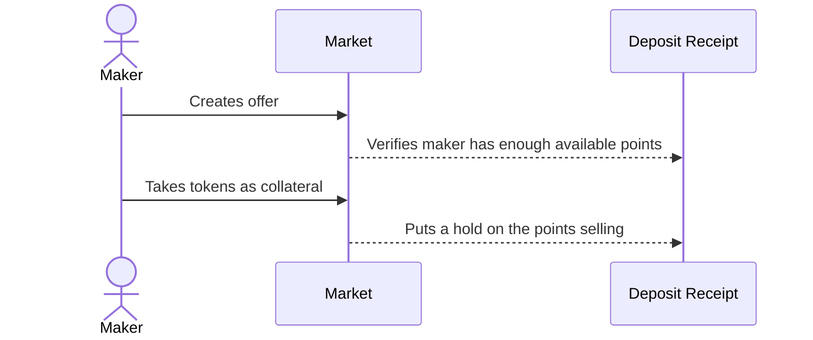
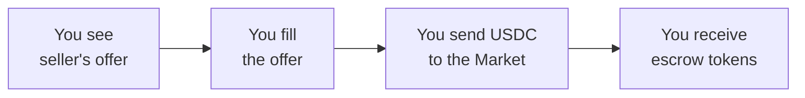
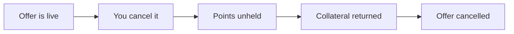
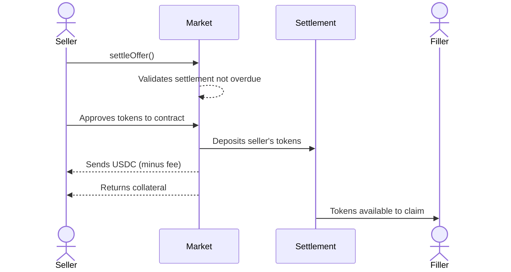
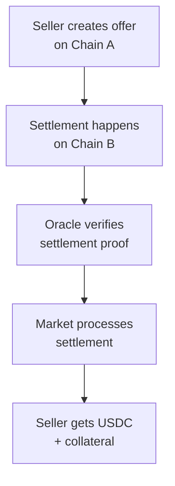
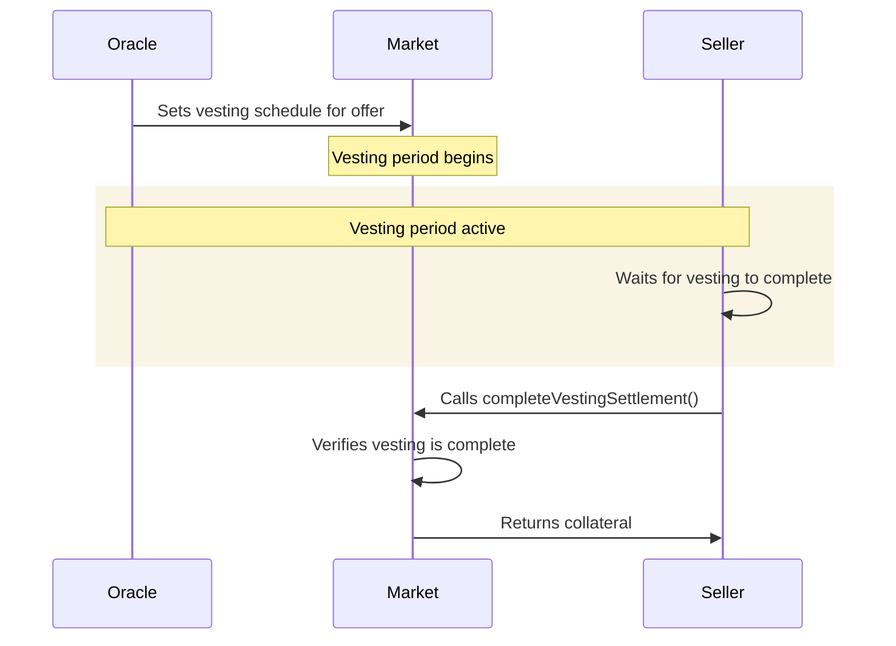
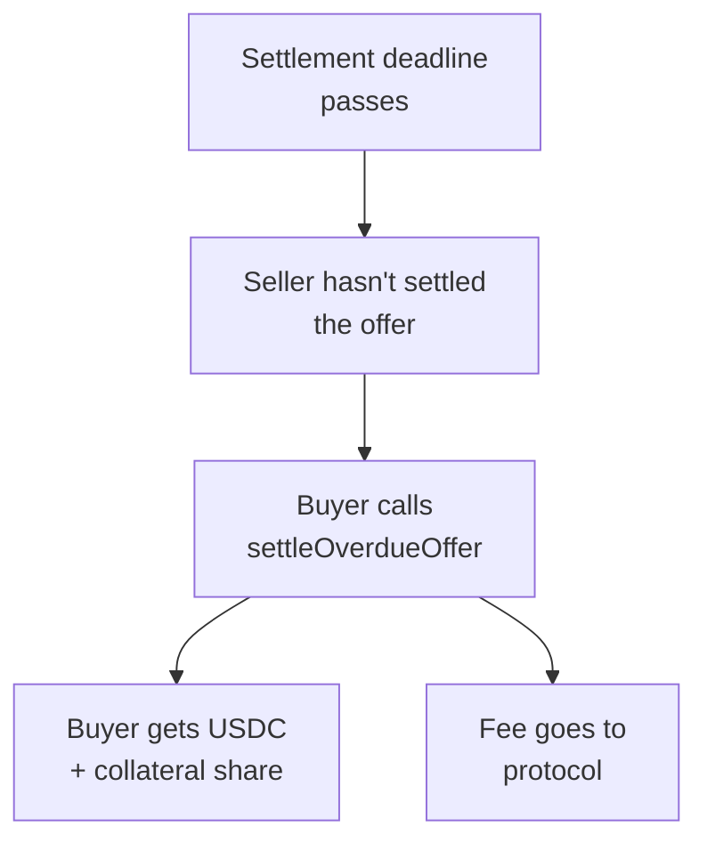

# Market Trading

The Market contract is a decentralized order book for buying and selling escrow tokens (tokenized
points) before TGE. It also handles the conversion of escrow tokens to actual tokens after TGE.

## How Offers Work

### What is an Offer?

An offer is a binding commitment to trade points at a specific price with collateral backing.

**Example**: "I'll sell you 500 of my points for 50 USDC, and I'm putting up 50 USDC as collateral
to guarantee this deal."

Of course we are not limited to using collateral as a guarantee, we can use off-chain agreements
(legal contracts) or credit scores as well, this is totally up to the discretion of the seller.

### Creating a Sell Offer

All offers include the the amount of points to sell, the price, the collateral token, and the
collateral amount. And all offers are able to be cancelled with the collateral returned (minus a
cancellation fee if defined), as long as there are no existing fills yet.

<Note>
  {" "}
  You must have a valid deposit receipt NFT with enough available points to create an offer.{" "}
</Note>

### Collateral

There are many different types of collateral that can be used to back an offer. We will discuss
liquid tokens such as USDC from now. However, sellers are not limited to using collateral tokens and
can use off-chain agreements or credit scores as well. When creating an offer, the seller puts up a
configurable amount of collateral. This collateral is held in escrow until the offer is settled, or
the offer is cancelled.

### Filling an Offer

When you see an offer you want to accept, you fill it as a buyer:

To fill an offer, you need USDC equal to the offer price. When you fill an offer, you send the USDC
to the `Market.sol` contract. You instantly receive escrow tokens minted 1:1 to the points. The
seller doesn't receive the USDC until settlement when they provide the escrow tokens. The seller's
collateral is only returned upon successful settlement.

<Danger>Once an offer is filled, both the maker and filler cannot cancel or reverse it.</Danger>

### Partial Fills

Offers can be filled multiple times if there's enough supply. This means multiple buyers can
participate in the same offer, each getting a share of the points without the seller needing to
create separate offers.

Consider this example: A seller creates an offer for 1000 points for 100 USDC. Three buyers fill it
partially over time:

| Step | Buyer   | Amount  | Price   | Remaining | Status           |
| ---- | ------- | ------- | ------- | --------- | ---------------- |
| 1    | Buyer 1 | 400 pts | 40 USDC | 600 pts   | PARTIALLY FILLED |
| 2    | Buyer 2 | 300 pts | 30 USDC | 300 pts   | PARTIALLY FILLED |
| 3    | Buyer 3 | 300 pts | 30 USDC | 0 pts     | FILLED           |

The seller collects 100 USDC total but reaches three different buyers without creating separate
offers.

### Cancelling Offers

You can cancel an offer if no one has filled it yet:

When you cancel an offer, your held points return to available so you can use them elsewhere. Your
collateral is returned to you, and the offer becomes inactive.

You can only cancel an offer if it hasn't been filled at all. Once someone fills even part of it,
you can't cancel anymore. If there's a cancellation fee configured, it will be deducted from your
returned collateral.

### Shortfall of Points

Points balances may unexpectedly change after an offer is created. If a seller's points decrease,
they may not have enough points to fulfill all their offers. In this case, fillers can call
`settlePointsChange()` to recover their USDC.

**Example:**

1. Seller deposits 500 points
2. Seller creates an offer for 500 points at 100 USDC
3. Filler fills the offer, paying 100 USDC and receiving 500 escrow tokens
4. Seller's points drop to 300 (due to an external points program update)
5. Filler calls `settlePointsChange()` to settle with the new points balance

**What happens:**

- Filler's escrow tokens are burned completely
- Filler receives their USDC back in full
- Seller's held points are released
- The filler is able to fill the offer again with the new points balance

<Note>
  {" "}
  If after settling there are no fillers left, the offer is able to be cancelled by the seller.
</Note>

## Settlement

### Standard Settlement

The normal path when the seller provides tokens before the settlement deadline:

When TGE happens and the actual token launches, the seller calls `settleOffer()` to finalize the
deal. The Market validates that the settlement hasn't passed the deadline, takes the seller's
tokens, deposits them to the `Settlement.sol` contract, and sends the USDC proceeds to the seller
(minus the settlement fee if defined). The seller also gets their collateral back, and the filler
can now claim their tokens from the `Settlement.sol` contract.

### Cross-Chain Settlement (settleOfferViaOracle)

For points programs on different blockchains, the oracle can verify settlement across chains:

This is useful when the points program is on a different chain than the Market. You create an offer
on one chain, the buyer fills it, but the actual token launches on another chain. You settle on that
chain by providing the tokens, then call `settleOfferViaOracle()` with the chain ID, transaction
hash, and Oracle signature. The oracle verifies the settlement happened on the other chain, and the
Market sends you USDC and collateral back on the original chain.

### Vesting Settlement (completeVestingSettlement)

For token programs with vesting schedules, settlement happens in two phases:

When a token has a vesting schedule, your collateral is held longer - through the entire vesting
period. On day 1, your offer is filled with vesting enabled. Days 1-90 are the vesting period when
tokens unlock gradually. On day 91, when vesting completes, you call `completeVestingSettlement()`
and finally get your collateral back. This is different from standard settlement where collateral is
returned immediately.

### Overdue Settlement (settleOverdueOffer)

If the seller doesn't settle before the deadline, buyers have recourse:

This is the protection mechanism that makes the system trustless. When the settlement deadline
arrives and the seller hasn't settled the offer, buyers can call `settleOverdueOffer()`. They
immediately get their USDC payment back, plus a proportional share of the seller's collateral (after
the protocol takes a small fee). This incentivizes sellers to settle on time, because if they don't,
their collateral is distributed to the buyers as compensation.

For example, if an offer has a 100 USDC price with 100 USDC collateral and a 5% protocol fee, and
three buyers filled it with 50 USDC, 30 USDC, and 20 USDC respectively, each buyer gets their
payment back plus their share of the remaining collateral. The first buyer gets ~97.5 USDC, the
second gets ~58.5 USDC, and the third gets ~39 USDC, with the protocol keeping 5 USDC plus any dust.
This way, everyone has recourse if the seller doesn't perform.

## Advanced Concepts

### Partial Fills with Settlement

When multiple buyers fill the same offer at different times, settlement becomes more complex. With
an offer of 1000 points for 100 USDC, Buyer A might fill 400 points for 40 USDC, Buyer B fills 300
points for 30 USDC, and Buyer C fills 300 points for 30 USDC. When the seller settles with 100 USDC
worth of tokens, Buyer A gets 40 USDC worth, Buyer B gets 30 USDC worth, and Buyer C gets 30 USDC
worth - each proportional to their fill. If the points decreased to 600, each buyer gets 60% of
their expected share, and they can individually call `settlePointsChange()` for refunds on the
shortfall.

### Fee Structure

The protocol takes fees at several key moments:

| Action           | Fee Type            | When Applied       |
| ---------------- | ------------------- | ------------------ |
| Offer Creation   | None                | Creating           |
| Settlement       | settlementFee (%)   | Settling           |
| Cancellation     | cancellationFee (%) | Cancelling         |
| Overdue Handling | overdueFee (%)      | Overdue settlement |

For example, if you create an offer for 500 points at 100 USDC with 50 USDC collateral and the
settlement fee is 2%, you'll provide 500 tokens to settle and receive 100 USDC - 2 USDC = 98 USDC,
plus your 50 USDC collateral back. If you cancel the offer with a 1% cancellation fee, you get back
50 USDC - 0.5 USDC = 49.5 USDC.

## Price Discovery

The Market enables natural price discovery. If your offer is too expensive, buyers won't fill it and
prices drop. If it's too cheap, sellers sell out quickly and prices go up. When you find a fair
price, trades happen regularly at that level. This creates a market-driven price for your points
before TGE.

## Trading Strategies

### Strategy 1: Quick Liquidity

Create low-priced offers to sell quickly. This strategy is best if you need cash now rather than
waiting for TGE.

### Strategy 2: Speculative Hold

Hold your points and don't trade. Bet they'll be worth more at TGE.

### Strategy 3: Time the Market

Create offers at times when prices are high. Check the market regularly for good selling windows.

### Strategy 4: Partial Offers

Create very large offers to attract multiple buyers and get exposure to more traders.

## Key Concepts

### Available vs. Held Points

Available points are not in any offer and are free to trade. Held points are in an active offer and
reserved for that specific trade.

### Collateral

Both sides put up guarantees that protect against dishonest behavior. Collateral is returned when
trades complete normally, but forfeited if someone defaults.

### Offer Status

**CREATED** means the offer is new and waiting for buyers. **FILLED_PARTIAL** means it's partially
sold with more to go. **FILLED** means it's completely sold and awaiting settlement. **SETTLED**
means it's all done with tokens distributed. **CANCELLED** means the maker cancelled it.

## Safety

Your points are protected because escrow tokens only transfer when the price is paid, and collateral
guarantees both sides. Contracts verify everything before executing. Fair pricing is ensured because
there's no price manipulation (collateral prevents it), the market sets prices naturally, and
everyone can see all offers. Settlement is guaranteed because makers must provide tokens to settle,
if they don't then collateral compensates fillers, and the oracle can verify settlement on-chain.

## Key Takeaways

Offers let you buy and sell escrow tokens at a price you set. Collateral from both sides makes
trades trustworthy. Partial fills let one seller reach multiple buyers. Cancellation returns your
points if it hasn't filled yet. Settlement converts your offer into final tokens after TGE. There's
no intermediary - everything is code and collateral.

## Important Notes

### Settlement Windows

Before TGE happens, you can't settle offers yet. During the active settlement period after TGE, you
can settle offers. After the deadline passes, you can no longer settle but buyers can claim overdue
offers.

### Gas Optimization

For multiple offers, use batch operations like `getOffersBatch()` to get multiple offers in one
call. This reduces read operations and gas costs.

### State Transitions

Not all state transitions are valid. You can go from CREATED → FILLED_PARTIAL → FILLED → SETTLED. Or
directly from CREATED → FILLED → SETTLED. You can go from CREATED → CANCELLED. But you cannot go
from FILLED → CREATED, from SETTLED → ANYTHING, or from CANCELLED → ANYTHING.
