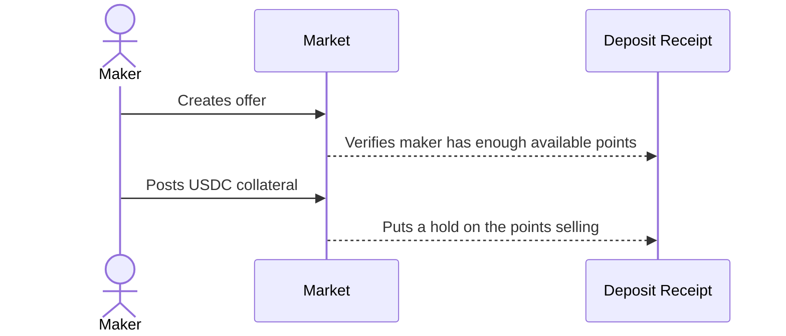
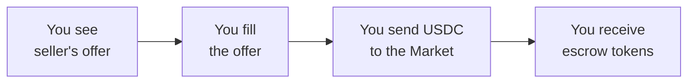
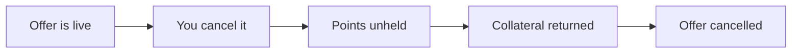
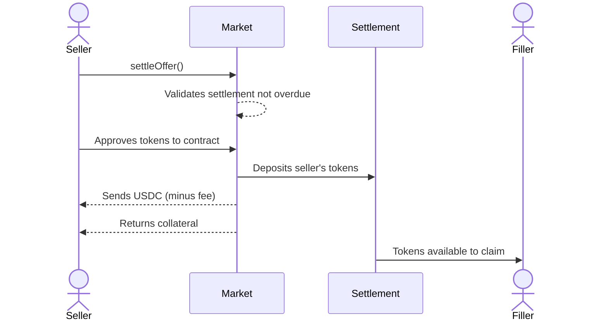
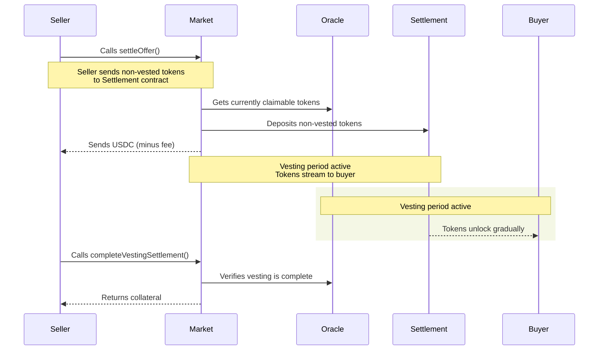
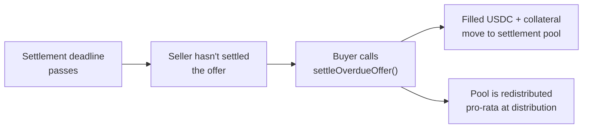

# Market Trading

The Market contract is a decentralized order book for buying and selling tokenized points before
TGE. It handles offer creation, collateral validation, escrow minting, and routing filled offers
into settlement.

## How Offers Work

### What is an Offer?

An offer is a binding commitment to trade points at a specific price with optional or required USDC
collateral backing, depending on the market configuration.

**Example**: "I'll sell you 500 of my points for 50 USDC, and I'm putting up 50 USDC as collateral
to guarantee this deal."

### Collateral

Collateral is posted in USDC and held by the market until the offer is settled, cancelled, or moved
into overdue settlement.

Markets that cannot directly escrow or custody the underlying points can use
collateral-weighted minting to reduce seller default risk. Those markets can define:

- whether collateral is enforced
- a minimum collateral weight an offer must satisfy
- an ideal USDC collateral per point target

On those markets, the ideal collateral target drives weighted minting of `chXXX` on fill. Higher
collateral generally means a higher mint weight, subject to the escrow token's cap.

On markets where Checkpoint can escrow the underlying points directly, buyers mint `chXXX` 1:1 with
the filled points amount as usual.

### Offer Status

| Status                     | Description                                                                                        |
| -------------------------- | -------------------------------------------------------------------------------------------------- |
| OFFER_CREATED              | The offer is new and waiting for buyers to fill it.                                                |
| OFFER_FILLED_PARTIAL       | The offer has been partially filled by one or more buyers, with more supply remaining.             |
| OFFER_FILLED               | The offer is completely filled by buyers.                                                          |
| OFFER_SETTLED              | The offer has been settled with tokens provided to the Settlement contract for buyers to claim.    |
| OFFER_SETTLED_WITH_VESTING | The offer has been settled but has a vesting schedule. Tokens unlock gradually over time.          |
| OFFER_CANCELLED            | The offer was cancelled by the maker before any fills, and collateral was returned.                |
| OFFER_OVERDUE_SETTLED      | The settlement deadline passed without the seller settling. The offer's filled USDC and collateral were moved into the program-wide settlement pool. |

### Creating a Sell Offer

```mermaid
  sequenceDiagram
  actor Maker
  participant Market
  participant Deposit Receipt

  Maker->>Market: Creates offer
  Market-->>Deposit Receipt: Verifies maker has enough available points
  Maker->>Market: Posts USDC collateral
  Market-->>Deposit Receipt: Puts a hold on the points selling
```

All offers include the amount of points to sell, the price in USDC, and the collateral amount in
USDC. Offers can be cancelled with collateral returned minus any configured cancellation fee, as
long as they have no existing fills.

<Note>
  {" "}
  You must have a valid deposit receipt NFT with enough available points to create an offer.{" "}
</Note>

### Filling an Offer

When you see an offer you want to accept, you fill it as a buyer:

```mermaid
graph LR
  A["You see<br/>seller's offer"]
  B["You fill<br/>the offer"]
  C["You send USDC<br/>to the Market"]
  D["You receive<br/>escrow tokens"]
  A --> B --> C --> D
```

To fill an offer, you send USDC to the `Market.sol` contract. The escrow mint path depends on the
market type:

- on standard escrowable markets, buyers mint `chXXX` 1:1 with the filled points amount
- on non-custodial markets, buyers mint from the offer's **collateral weight**

At a high level:

- the market either mints 1:1 or computes a weight from the offer's collateral versus the market's
  ideal collateral per point
- on weighted markets, the escrow token uses that weight to mint a discounted, neutral, or bonused
  amount of `chXXX`
- the protocol may also mint additional escrow tokens to the treasury via `fillExtra`

The seller does not receive the buyer's USDC until settlement. Their collateral is only returned on
successful settlement, or after vesting completes for vesting offers.

<Danger>Once an offer is filled, both the maker and filler cannot cancel or reverse it.</Danger>

### Partial Fills

Offers can be filled multiple times if there's enough supply. This means multiple buyers can
participate in the same offer, each getting a share of the points without the seller needing to
create separate offers.

Consider this example: A seller creates an offer for 1000 points for 100 USDC. Three buyers fill it
partially over time:

| Step | Buyer   | Amount  | Price   | Remaining | Status           |
| ---- | ------- | ------- | ------- | --------- | ---------------- |
| 1    | Buyer 1 | 400 pts | 40 USDC | 600 pts   | PARTIALLY FILLED |
| 2    | Buyer 2 | 300 pts | 30 USDC | 300 pts   | PARTIALLY FILLED |
| 3    | Buyer 3 | 300 pts | 30 USDC | 0 pts     | FILLED           |

The seller collects 100 USDC total but reaches three different buyers without creating separate
offers.

### Cancelling Offers

You can cancel an offer if no one has filled it yet:

```mermaid
graph LR
  A["Offer is live"]
  B["You cancel it"]
  C["Points unheld"]
  D["Collateral returned"]
  E["Offer cancelled"]
  A --> B --> C --> D --> E
```

When you cancel an offer, your held points return to available so you can use them elsewhere. Your
collateral is returned to you, and the offer becomes inactive.

You can only cancel an offer if it hasn't been filled at all. Once someone fills even part of it,
you can't cancel anymore. If there's a cancellation fee configured, it will be deducted from your
returned collateral.

### Shortfall of Points

Points balances may unexpectedly change after an offer is created. If a seller's points decrease,
they may not have enough points to fulfill all their offers. In this case, fillers can call
`settlePointsChange()` to recover their USDC.

**Example:**

1. Seller deposits 500 points
2. Seller creates an offer for 500 points at 100 USDC
3. Filler fills the offer, paying 100 USDC and receiving the escrow amount minted for that market
4. Seller's points drop to 300 (due to an external points program update)
5. Filler calls `settlePointsChange()` to settle with the new points balance

**What happens:**

- Filler must return the full escrow amount minted from that fill, which is then burned by the market
- Filler receives their USDC back in full
- Seller's held points are released
- The filler is able to fill the offer again with the new points balance

<Note>
  {" "}
  If after settling there are no fillers left, the offer is able to be cancelled by the seller.
</Note>

## Settlement

### Standard Settlement

The normal path when the seller provides tokens before the settlement deadline:

```mermaid
sequenceDiagram
  actor Seller
  participant Market
  participant Settlement
  actor Filler

  Seller->>Market: settleOffer()
  Market-->>Market: Validates settlement not overdue
  Seller->>Market: Approves tokens to contract
  Market->>Settlement: Deposits seller's tokens
  Market-->>Seller: Sends USDC (minus fee)
  Market-->>Seller: Returns collateral
  Settlement->>Filler: Tokens available to claim
```

When TGE happens and the actual token launches, the seller calls `settleOffer()` to finalize the
deal. The market validates that the settlement has not passed the deadline, takes the seller's
tokens, deposits them to `Settlement.sol`, and sends the filled USDC proceeds to the seller minus
the configured settlement fee. The seller also gets their collateral back unless the offer is under
vesting settlement.

Importantly, buyer claims are settled against the **program-wide settlement distribution**, not
directly against a single offer. Each settled offer contributes inventory into that shared
distribution.

### Crosschain Settlement

This is useful when the points program is on a different chain than the Market. Create an offer on
one chain, the buyer fills it, but the token launches on another chain. To settle:

1. Provide tokens to the `RemoteSettlement.sol` contract on the token's chain
2. Call `settleOfferViaOracle()` on `Market.sol` with the chain ID, transaction hash, and Oracle
   signature
3. The oracle verifies the settlement, and the Market sends you USDC and collateral back

The filler can then claim their tokens from `RemoteSettlement.sol` just like standard settlement.

### Partial Fills

If the offer is partially filled, the seller only needs to provide the percentage of tokens that was
filled.

**Formula:**

$$\text{tokensToSend} = \left\lfloor \frac{\text{tokenAmount} \times \text{filledAmount}}{\text{price}} \right\rfloor$$

**Example:**

- Offer: 1000 points for 100 USDC
- Buyers fill 60 USDC total (60% of the offer)
- Seller only needs to provide 60% of the final token amount assigned to that offer

Each buyer receives their proportional share when they claim from `Settlement.sol` or
`RemoteSettlement.sol`.

### Vesting Settlement

For token programs with vesting schedules, settlement happens in multiple phases:

```mermaid
sequenceDiagram
  participant Seller
  participant Market
  participant Oracle
  participant Settlement
  participant Buyer

  Seller->>Market: Calls settleOffer()
  Note over Seller,Market: Seller sends non-vested tokens<br/>to Settlement contract
  Market->>Oracle: Gets currently claimable tokens
  Market->>Settlement: Deposits non-vested tokens
  Market-->>Seller: Sends USDC (minus fee)
  Note over Market,Settlement: Vesting period active<br/>Tokens stream to buyer
  rect rgba(148, 173, 7, 0.1)
  Note over Oracle,Buyer: Vesting period active
  Settlement-->>Buyer: Tokens unlock gradually
  end
  Seller->>Market: Calls completeVestingSettlement()
  Market->>Oracle: Verifies vesting is complete
  Market-->>Seller: Returns collateral
```

When a token has a vesting schedule, settlement works differently:

1. **Initial Settlement (`settleOffer()`)**: The seller calls `settleOffer()` and sends only the
   tokens that are not vested (the currently claimable tokens according to the oracle's vesting
   schedule). These non-vested tokens are deposited to the Settlement contract and become available
   for the buyer to claim immediately.

2. **Vesting Period**: As time passes, the remaining vested tokens unlock gradually according to the
   vesting schedule. The oracle tracks when each tranche of tokens becomes claimable. The buyer can
   claim these tokens from the Settlement contract as they unlock.

3. **Complete Settlement (`completeVestingSettlement()`)**: Once the vesting period is fully
   complete, the seller calls `completeVestingSettlement()`. The oracle verifies that vesting has
   completed, and the seller finally receives their collateral back.

The key difference from standard settlement is that the seller's collateral is held as security
through the entire vesting period until all tokens have been vested and delivered to the buyer.

### Overdue Settlement

When a seller fails to settle by the deadline, the overdue offer is not resolved buyer-by-buyer.
Instead, its filled USDC plus seller collateral is moved into the settlement contract as a
**program-wide USDC pool** for that points market.

```mermaid
graph LR
  A["Settlement deadline<br/>passes"]
  B["Seller hasn't settled<br/>the offer"]
  C["Buyer calls<br/>settleOverdueOffer()"]
  D["Filled USDC + collateral<br/>move to settlement pool"]
  E["Pool is redistributed<br/>pro-rata at distribution"]

  A --> B --> C --> D
  C --> E
```

#### Settlement Process

When `settleOverdueOffer()` is called after the deadline:

1. The offer's filled USDC and seller collateral are deposited into `Settlement.sol`
2. That amount increases the USDC pool tracked for the entire points program
3. Escrow holders later claim a pro-rata share of that pooled USDC during distribution
4. There is no separate overdue fee in the current settlement flow

The redistribution is global to the market's points program. It is based on escrow balances at
distribution time, not on a direct per-offer refund path.

## Fee Structure

The market currently exposes three main fee levers:

- **Settlement fee**: taken from seller proceeds when `settleOffer()` or `settleOfferViaOracle()`
  succeeds
- **Cancellation fee**: taken from seller collateral when cancelling an unfilled offer
- **Fill extra**: extra escrow tokens minted to the fee recipient on every fill

`fillExtra` is a small inflation at the escrow-token layer used for seeding liquidity.
It increases total escrow supply rather than deducting USDC from the buyer or seller.
