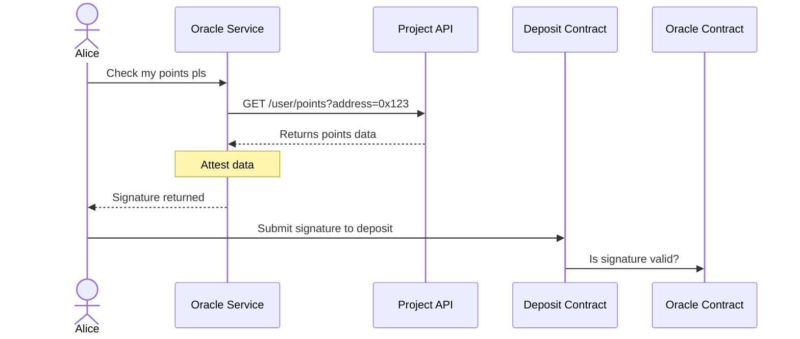

# Oracle System

The Oracle is Checkpoint's verification layer. It queries offchain points APIs, generates
cryptographic signatures to prove the data is legitimate, and the blockchain verifies these
signatures trustlessly. This approach makes onboarding new projects easy and simple.

## The Problem It Solves

How do we know users really have the points they claim without requiring projects to set up special
infrastructure?

- **Option 1: Require database access** - Projects expose their database, risky and requires extra
  work for them
- **Option 2: Require special APIs** - Projects must build custom endpoints just for Checkpoint
- **Option 3: Query existing APIs** - Oracle uses projects' existing APIs and cryptographically
  signs the response (Checkpoint's approach)

Even though the data comes directly from the project's own API, verification is fully trustless, the
smart contracts verify the signature to ensure authenticity.

## How It Works



## Easy Project Integration

**Anyone can integrate their project into Checkpoint**

To get your project's points integrated into Checkpoint's Oracle system and the
[Points Aggregator](https://points.0xportal.io/) simply create an adapter in the
[points-adapters](https://github.com/0xPortalLabs/points-adapters) repository.

#### How It Works

An adapter is a simple piece of code that:

1. Takes a user's wallet address as input
2. Queries your project's existing points API
3. Returns the points data in a standardized format

#### What You Need to Do

- **Create an adapter** for your project (using web standard APIs)
- **Define key exports**: `fetch`, `data`, `total`, and optional `rank` and `deprecated`
- **Submit a pull request** to the
  [points-adapters](https://github.com/0xPortalLabs/points-adapters) repository.

No need to build custom infrastructure, expose your database, or create special endpoints. Read more
about
[getting started](https://github.com/0xPortalLabs/points-adapters?tab=readme-ov-file#getting-started).

## Types of Verifications

### 1. Deposit

- Verify a user's points and get a signature for a deposit transaction

**POST /claim/deposit**

- [Full documentation →](/api-reference/claims/get-deposit-claim)

```bash Example Request
curl -X POST "https://oracle.checkpoint.exchange/claim/deposit" \
  -H "Content-Type: application/json" \
  -d '{
    "address": "0x69155e7ca2e688ccdc247f6c4ddf374b3ae77bd6",
    "pointsId": 1
  }'
```

```json Example Response
{
  "success": true,
  "claim": {
    "nonce": "0",
    "expiry": "1760896448",
    "chainId": "13505",
    "amount": "5314000000000000000000",
    "user": "0x69155e7ca2e688ccdc247f6c4ddf374b3ae77bd6",
    "pointsId": "1"
  },
  "signature": "0xd1ede18892adf865739b755a274ae470fc293344b1787564d711b541ca53db827b3cfec75afd1c2b70d1ca3b08ffa5d159bc9df3a4359df84ae99dd8deb2c4ca1b"
}
```

### 2. Settlement

**POST /claim/settlement**

- Verify that a trade was properly settled onchain and get a signature for a crosschain settlement
  transaction
- [Full documentation →](/api-reference/claims/get-settlement-claim)

```bash Example Request
# TODO
```

```json Example Response
# TODO
```

## Tracking Historical Changes

When your points balance changes, the oracle records this onchain via `changePoints()`.

<Info> This usually happens every 24 hours but there is no strong guarantee. </Info>

Learn how to query the data
[here](/architecture/points-tokenization#1-soulbound-nft-chxxx-r-tokens).

## API Reference

The Oracle provides endpoints for interacting with claim verification

<Note>
  **Try it now!** Visit the [Oracle API playground](/api/oracle-api) to test the endpoints
  interactively. Fill in your parameters and click "Try it Now" to see live responses from the
  Oracle.
</Note>
