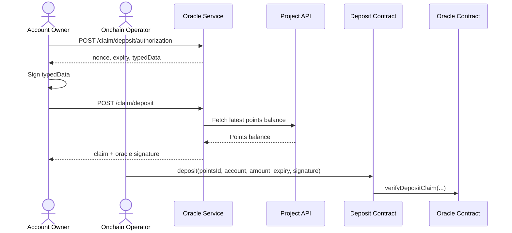

# Oracle System

The Oracle is Checkpoint's verification layer. It queries offchain points APIs, generates
cryptographic signatures to prove the data is legitimate, and the blockchain verifies these
signatures trustlessly.

For deposits, the flow is now split into two steps:

1. The account owner signs a short-lived authorization for a specific `pointsId` and `operator`.
2. The oracle verifies that authorization, fetches the latest points balance, and signs the deposit
   claim that the `Deposit` contract checks onchain.

This keeps the points holder account and the EVM wallet submitting the transaction explicitly
separate.

## The Problem It Solves

How do we know users really have the points they claim without requiring projects to set up special
infrastructure?

- **Option 1: Require database access**: Projects expose their database, which is risky and adds
  work
- **Option 2: Require special APIs**: Projects build custom endpoints just for Checkpoint
- **Option 3: Query existing APIs**: The oracle uses the project's existing API and signs the
  verified result

Even though the data comes directly from the project's own API, verification is fully trustless. The
contracts verify the oracle signature before a deposit or settlement can proceed.

## How It Works


```mermaid
sequenceDiagram
    actor Owner as Account Owner
    actor Operator as Onchain Operator
    participant Oracle as Oracle Service
    participant PointsAPI as Project API
    participant Deposit as Deposit Contract
    participant OracleContract as Oracle Contract

    Owner->>Oracle: POST /claim/deposit/authorization
    Oracle-->>Owner: nonce, expiry, typedData
    Owner->>Owner: Sign typedData
    Owner->>Oracle: POST /claim/deposit
    Oracle->>PointsAPI: Fetch latest points balance
    PointsAPI-->>Oracle: Points balance
    Oracle-->>Owner: claim + oracle signature
    Operator->>Deposit: deposit(pointsId, account, amount, expiry, signature)
    Deposit->>OracleContract: verifyDepositClaim(...)
```

## Account Model

- `account` is the canonical ERC-7930 representation of the underlying points holder, such as an EOA
- `operator` is the EVM wallet allowed to perform the onchain deposit for that account
- The oracle normalizes the input account before signing or verifying claims

For a portable EVM account without an embedded chain reference, the canonical ERC-7930 encoding is:

```text
0x000100000014<20-byte-address>
```

For example, the account for `0xd8dA6BF26964aF9D7eEd9e03E53415D37aA96045` is:

```text
0x000100000014d8da6bf26964af9d7eed9e03e53415d37aa96045
```

## Easy Project Integration

**Anyone can integrate their project into Checkpoint**

To get your project's points integrated into Checkpoint's Oracle system and the
[Points Aggregator](https://checkpoint.exchange/) simply create an adapter in the
[points-adapters](https://github.com/0xPortalLabs/points-adapters) repository.

#### How It Works

An adapter is a simple piece of code that:

1. Takes a user's account identifier as input
2. Queries your project's existing points API
3. Returns the points data in a standardized format

#### What You Need to Do

- **Create an adapter** using standard web APIs
- **Define key exports**: `fetch`, `data`, `total`, and optional `rank` and `deprecated`
- **Submit a pull request** to the
  [points-adapters](https://github.com/0xPortalLabs/points-adapters) repository

No need to build custom infrastructure, expose your database, or create special endpoints. Read more
about
[getting started](https://github.com/0xPortalLabs/points-adapters?tab=readme-ov-file#getting-started).

## Types of Verifications

### 1. Deposit Authorization

**POST /claim/deposit/authorization**

- Resolve the requested account
- Return the nonce, expiry, and EIP-712 payload that the account owner must sign
- [Full documentation →](/api-reference/claims/get-deposit-authorization)

```bash Example Request
curl -X POST "https://oracle.checkpoint.exchange/claim/deposit/authorization" \
  -H "Content-Type: application/json" \
  -d '{
    "pointsId": "1",
    "account": "0x000100000014d8da6bf26964af9d7eed9e03e53415d37aa96045",
    "operator": "0x69155e7ca2e688ccdc247f6c4ddf374b3ae77bd6"
  }'
```

<Note>
  The response includes a JSON-safe `typedData` view plus the raw authorization fields. With viem,
  rebuild the typed data using bigint values before signing.
</Note>

### 2. Deposit Claim

**POST /claim/deposit**

- Verify the signed deposit authorization
- Fetch the latest points balance
- Return the oracle claim and signature to pass into `Deposit.deposit(...)`
- [Full documentation →](/api-reference/claims/get-deposit-claim)

```bash Example Request
curl -X POST "https://oracle.checkpoint.exchange/claim/deposit" \
  -H "Content-Type: application/json" \
  -d '{
    "pointsId": "1",
    "account": "0x000100000014d8da6bf26964af9d7eed9e03e53415d37aa96045",
    "operator": "0x69155e7ca2e688ccdc247f6c4ddf374b3ae77bd6",
    "authorization": {
      "nonce": "0",
      "expiry": "1760896448",
      "signature": "0xabc123..."
    }
  }'
```

```json Example Response
{
  "success": true,
  "claim": {
    "chainId": "421614",
    "pointsId": "1",
    "account": "0x000100000014d8da6bf26964af9d7eed9e03e53415d37aa96045",
    "operator": "0x69155e7ca2e688ccdc247f6c4ddf374b3ae77bd6",
    "amount": "5314000000000000000000",
    "expiry": "1760896448",
    "nonce": "0"
  },
  "signature": "0xd1ede18.."
}
```

### 3. Settlement

**POST /claim/settlement**

- Verify that a trade was properly settled onchain
- Return the oracle signature for the settlement transaction
- [Full documentation →](/api-reference/claims/get-settlement-claim)

```bash Example Request
curl -X POST "https://oracle.checkpoint.exchange/claim/settlement" \
  -H "Content-Type: application/json" \
  -d '{
    "chainId": 42161,
    "evm_tx": "0xabc..",
    "offerId": "123"
  }'
```

```json Example Response
{
  "success": true,
  "claim": {
    "chainId": "421614",
    "offerId": "123",
    "account": "0x000100000014d8da6bf26964af9d7eed9e03e53415d37aa96045",
    "settlementChainId": "42161",
    "txhash": "0xabc..",
    "expiry": "1760896448",
    "nonce": "0"
  },
  "signature": "0xd1ede18.."
}
```

## Tracking Historical Changes

When your points balance changes, the oracle records this onchain via `changePoints()`.

<Info> This usually happens every 24 hours but there is no strong guarantee. </Info>

Learn how to query the data
[here](/architecture/points-tokenization#1-deposit-receipt-chxxx-r-tokens).

## API Reference

The Oracle provides endpoints for interacting with claim verification.

<Note>
  **Try it now!** Visit the [Oracle API playground](/api/oracle-api) to test the endpoints
  interactively. Fill in your parameters and click "Try it Now" to see live responses from the
  Oracle.
</Note>
