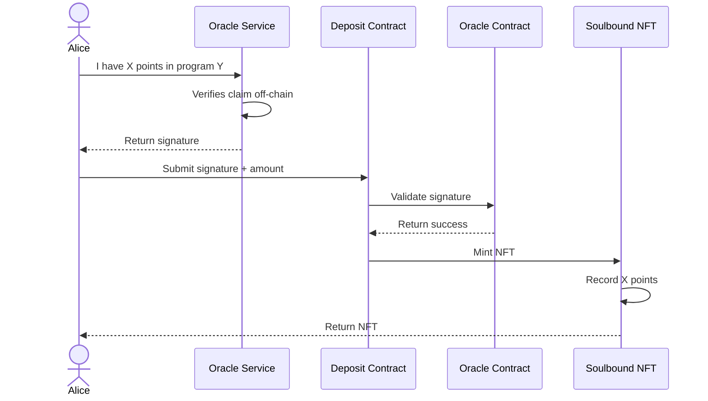

# Points Tokenization

The points tokenization system transforms your off-chain loyalty points into real, tradeable
on-chain assets. It's a three-step process: verification, minting, and tracking.

## The Deposit Process



## Dual-Token Model

When you deposit points, you receive a **Soulbound NFT** that represents your points. Later, when
your offer is filled on the market, **ERC20 tokens** are minted. This two-stage design creates
security and efficiency:

### 1. Soulbound NFT (chXXX-R tokens)

Minted immediately at deposit. A non-transferable receipt that proves you deposited X amount of
points and tracks changes to your points amount over time. This NFT is your proof of deposit and is
required to create offers on the market.

Referenced as the `DepositReceipt.sol` contract.

**On-chain points data**:

Point balance changes are tracked on-chain via the
[Oracle](./oracle-system#tracking-historical-changes), which internally uses
[OpenZeppelin's Checkpoints](https://github.com/OpenZeppelin/openzeppelin-contracts/blob/master/contracts/utils/structs/Checkpoints.sol)
library to maintain an immutable record of all balance updates.

This data is queryable on-chain via the Soulbound NFT (DepositReceipt.sol)

<CodeGroup>

```solidity getUserData
function getUserData(address user)
    external
    view
    returns (
        uint256 depositedAmount,
        uint256 heldAmount,
        uint256 latestPointsAmount,
        uint256 latestClaimTime
    );
```

```solidity getUserCumulativeDelta
/// @dev This function returns checkpoint values at the boundaries of a time range.
///      - `lower` uses `lowerLookup(start)` which finds the checkpoint at or after `start` (key >= start)
///      - `upper` uses `upperLookup(end)` which finds the checkpoint at or before `end` (key <= end)
///
///      IMPORTANT: When the time range [start, end] contains no checkpoints, `lower` will be from
///      a checkpoint AFTER the range, while `upper` will be from a checkpoint BEFORE the range.
///      This causes `lower` > `upper`, which may be counterintuitive.
///
///      Example: Given checkpoints at timestamps (50, value=100) and (60, value=200)
///      - Query with start=51, end=59 returns:
///        - lower = 200 (from checkpoint at t=60, the first checkpoint >= 51)
///        - upper = 100 (from checkpoint at t=50, the last checkpoint <= 59)
function getUserCumulativeDelta(address user, uint256 start, uint256 end)
    external
    view
    returns (uint256 upper, uint256 lower);
```

```solidity getUserHistoricalPoints
function getUserHistoricalPoints(address user)
    external
    view
    returns (Checkpoints.Checkpoint256[] memory res);
```

</CodeGroup>

### 2. Escrow Token (chXXX tokens)

Minted when someone fills your offer on Market.sol. An ERC20 token backed 1:1 by your points. Once
minted, it's tradeable just like any other token and can be traded, lent, etc. This is essentially
an escrow token for the real token until TGE.

Referenced as the `EscrowToken.sol` contract.

**On Protocol Token Generation Event (TGE)**:

- The escrow tokens are redeemable for the real tokens at a given ratio determined by
  `Settlement.sol`

The redemption ratio is calculated as:

$$\text{tokenRatio} = \left\lfloor \frac{\text{totalTokenAmount} \times \text{RATIO\_PRECISION}}{\text{totalEscrowSupply}} \right\rfloor$$

Where:

- **totalTokenAmount** => `ERC20(TGEToken).balanceOf(address(settlement))`
- **RATIO_PRECISION** => 10\*\*18
- **totalEscrowSupply** => `ERC20(escrowToken).totalSupply()`

## Hold System

When you create an offer to sell points in the [Market](/architecture/market-trading), your points
are "held" temporarily and are freed when the offer is cancelled.

- **Held points**: Reserved for your pending trade
- **Available points**: Free to use or trade elsewhere
- **Total points**: Held + Available = Your complete balance
