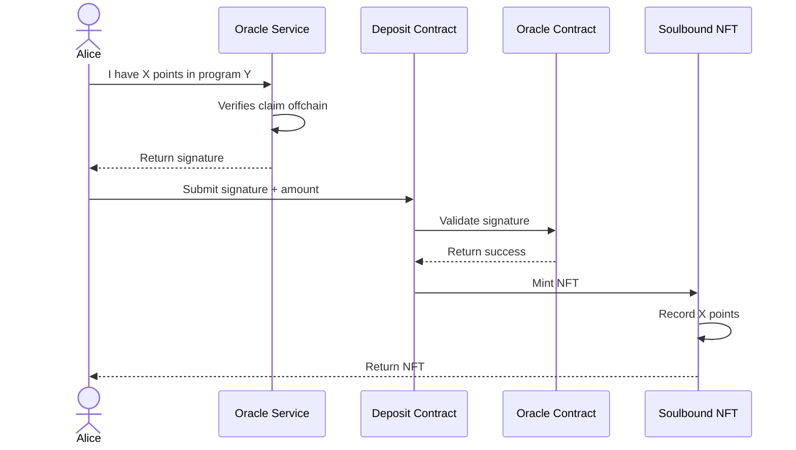
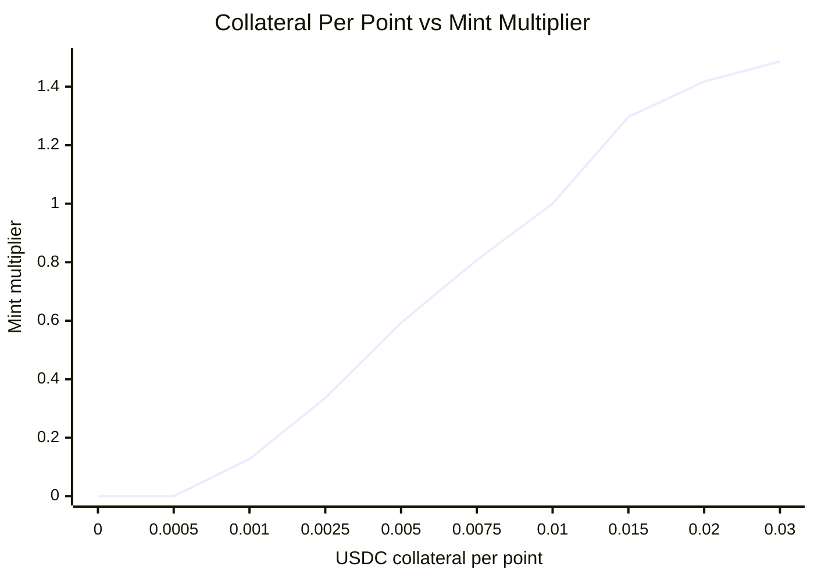

# Points Tokenization

The points tokenization system transforms your offchain loyalty points into real, tradeable
onchain assets.

## The Deposit Process


```mermaid
  sequenceDiagram
    actor User as Alice
    participant Oracle as Oracle Service
    participant Deposit as Deposit Contract
    participant Oracle Contract
    participant NFT as Soulbound NFT

    User->>Oracle: I have X points in program Y
    Oracle->>Oracle: Verifies claim offchain
    Oracle-->>User: Return signature
    User->>Deposit: Submit signature + amount
    Deposit->>Oracle Contract: Validate signature
    Oracle Contract-->>Deposit: Return success
    Deposit->>NFT: Mint NFT
    NFT->>NFT: Record X points
    NFT-->>User: Return NFT
```

## Dual-Token Model

When you deposit points, you receive a **Soulbound NFT** that represents your points. Later, when
your offer is filled on the market, **ERC20 tokens** are minted. This two-stage design creates
security and efficiency:

### 1. Soulbound NFT (chXXX-R tokens)

Minted immediately at deposit. A non-transferable receipt that proves you deposited X amount of
points and tracks changes to your points amount over time. This NFT is your proof of deposit and is
required to create offers on the market.

Referenced as the `DepositReceipt.sol` contract.

**onchain points data**:

Point balance changes are tracked onchain via the
[Oracle](./oracle-system#tracking-historical-changes), which internally uses
[OpenZeppelin's Checkpoints](https://github.com/OpenZeppelin/openzeppelin-contracts/blob/master/contracts/utils/structs/Checkpoints.sol)
library to maintain an immutable record of all balance updates.

This data is queryable onchain via the Soulbound NFT (DepositReceipt.sol)

<CodeGroup>

```solidity getUserData
function getUserData(address user)
    external
    view
    returns (
        uint256 depositedAmount,
        uint256 heldAmount,
        uint256 latestPointsAmount,
        uint256 latestClaimTime
    );
```

```solidity getUserCumulativeDelta
/// @dev This function returns checkpoint values at the boundaries of a time range.
///      - `lower` uses `lowerLookup(start)` which finds the checkpoint at or after `start` (key >= start)
///      - `upper` uses `upperLookup(end)` which finds the checkpoint at or before `end` (key <= end)
///
///      IMPORTANT: When the time range [start, end] contains no checkpoints, `lower` will be from
///      a checkpoint AFTER the range, while `upper` will be from a checkpoint BEFORE the range.
///      This causes `lower` > `upper`, which may be counterintuitive.
///
///      Example: Given checkpoints at timestamps (50, value=100) and (60, value=200)
///      - Query with start=51, end=59 returns:
///        - lower = 200 (from checkpoint at t=60, the first checkpoint >= 51)
///        - upper = 100 (from checkpoint at t=50, the last checkpoint <= 59)
function getUserCumulativeDelta(address user, uint256 start, uint256 end)
    external
    view
    returns (uint256 upper, uint256 lower);
```

```solidity getUserHistoricalPoints
function getUserHistoricalPoints(address user)
    external
    view
    returns (Checkpoints.Checkpoint256[] memory res);
```

</CodeGroup>

### 2. Escrow Token (chXXX tokens)

Minted when someone fills your offer on `Market.sol`.

There are two minting paths:

- **Custodied or escrowable markets**: buyers mint `chXXX` 1:1 against the filled points amount
- **Non-custodial markets**: buyers mint `chXXX` using **collateral-weighted minting** to account
  for seller default risk when the protocol cannot directly escrow the underlying points

For the collateral-weighted path, each market can define an **ideal USDC collateral per point**
target. When an offer is filled, the protocol compares the seller's posted collateral against that
market target and derives a collateral weight. That weight then feeds the escrow token mint curve:

- below the ideal collateral target, buyers mint fewer `chXXX` than raw points filled
- at the ideal collateral target, buyers mint at the default/neutral rate
- above the ideal collateral target, buyers can mint more `chXXX`, up to the escrow token's max
  weight cap

This means two offers for the same number of points can mint different amounts of `chXXX` on
non-custodial markets depending on how much collateral backs each offer. As a result this
promotes sellers to back the offers with more collateral, win-win.

Referenced as the `EscrowToken.sol` contract.

**Fill extra**

On every fill, the market can also mint an extra amount of escrow tokens to the protocol treasury
using the `fillExtra` config. This is a small inflationary escrow-side fee, not an additional
USDC charge taken from the buyer or the seller and is used for seeding escrow token liquidity.

### Weighted Mint Curve

On non-custodial markets, the weighted mint path uses the `WeightedCurve` library to convert a
collateral weight into a mint multiplier.

The curve constants are:

- `C_MIN = 0.05`
- `ALPHA = 0.7`
- `R_MAX = 0.5`
- `K = 1.8`
- `IDEAL_WEIGHT_BPS = 10_000` (100%)
- `MAX_WEIGHT_BPS = 30_000` (300%)

First, the market derives a normalized collateral ratio:

$$
weight = \min(\text{weightBps}, \text{maxWeightBps})
$$

$$
c = \frac{weight}{\text{idealWeightBps}}
$$

Then the mint multiplier $m$ is computed piecewise:

$$
m(c) =
\begin{cases}
0, & c \le C_{MIN} \\
\left(\frac{c - C_{MIN}}{1 - C_{MIN}}\right)^{\alpha}, & C_{MIN} < c \le 1 \\
1 + R_{MAX}\left(1 - e^{-K(c - 1)}\right), & c > 1
\end{cases}
$$

So the weighted escrow token mint amount is:

$$
\text{mintedAmount} = \left\lfloor \text{pointsAmount} \times m(c) \right\rfloor
$$

This gives the curve three useful regions:

- **Below 5% of ideal collateral**: minting is zero
- **From 5% to 100% of ideal collateral**: minting increases with a concave penalty curve
- **Above 100% of ideal collateral**: minting receives a bonus that saturates toward the max weight

### Example Curve

Assume a market sets the **ideal collateral per point** to **`$0.01 USDC`**.

That means:

$$
\text{weightBps} = \frac{\text{collateralPerPoint}}{0.01} \times 10{,}000
$$

with `IDEAL_WEIGHT_BPS = 10_000` and `MAX_WEIGHT_BPS = 30_000`.


```mermaid
xychart-beta
    title "Collateral Per Point vs Mint Multiplier"
    x-axis "USDC collateral per point" [0, 0.0005, 0.001, 0.0025, 0.005, 0.0075, 0.01, 0.015, 0.02, 0.03]
    y-axis "Mint multiplier" 0 --> 1.5
    line [0.0000, 0.0000, 0.1273, 0.3360, 0.5927, 0.8075, 1.0000, 1.2967, 1.4174, 1.4863]
```

**On Protocol Token Generation Event (TGE)**:

- The escrow tokens are redeemable for the real tokens at a given ratio determined by
  `Settlement.sol`

The redemption ratio is calculated as:

$$\text{tokenRatio} = \left\lfloor \frac{\text{totalTokenAmount} \times \text{RATIO\_PRECISION}}{\text{totalEscrowSupply}} \right\rfloor$$

Where:

- **totalTokenAmount** => `ERC20(TGEToken).balanceOf(address(settlement))`
- **RATIO_PRECISION** => 10\*\*18
- **totalEscrowSupply** => `ERC20(escrowToken).totalSupply()`

<Warning>
Final settlement is based on your share of the total escrow supply for that
points program, not on a fixed points-to-token conversion that is pre-determined.
</Warning>

## Hold System

When you create an offer to sell points in the [Market](/architecture/market-trading), your points
are "held" temporarily and are freed when the offer is cancelled.

- **Held points**: Reserved for your pending trade
- **Available points**: Free to use or trade elsewhere
- **Total points**: Held + Available = Your complete balance
