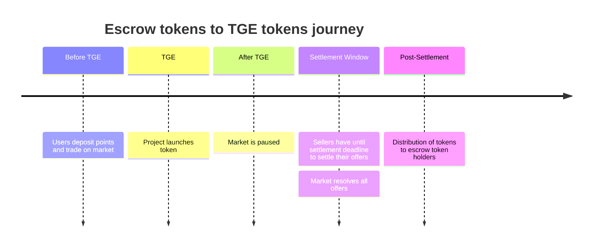

# Program Settlement

Settlement is the final step: converting your escrow (chXXX) tokens into the actual airdropped
tokens. For projects launching on a chain we do not natively settle the tokens on, Checkpoint uses
[LayerZero v2](https://layerzero.network/) to coordinate distribution across chains seamlessly.

## What is Settlement?

Settlement is the process that happens after TGE (Token Generation Event) where:

1. The project token launches on one or more blockchains
2. Checkpoint activates settlement for that points program
3. Escrow tokens convert to the actual airdropped tokens at a determined ratio
4. Users can claim their tokens on the any supported chain

<Danger>Escrow tokens conversion is only one way and CANNOT be reversed.</Danger>

## The Timeline

## Settlement

For projects launching on the same chain we natively settle on (Gravity Chain), users simply
interact with the `Settlement.sol` contract.

Users can either claim the distribution directly via `claimDistribution()` or they can wait for an
airdrop to their wallet which will be announced by Checkpoint well in advance if done so.

<Info>You will receive both collateral back and the tokens on Gravity Chain.</Info>

### Settlement on another chain

For projects launching on a different chain, users must interact with the `RemoteSettlement.sol`
contract on that relevant chain.

Checkpoint will take a snapshot of the escrow tokens and TGE tokens distribution beforehand and will
store this onchain on `Settlement.sol`. Then anyone can permissionlessly send the message to the
`RemoteSettlement.sol` contract on the relevant chain via the `sendSettlementMessage()` method on
`Settlement.sol`.

Just like with the same chain settlement, users can either claim the distribution directly via
`claimDistribution()` or they can wait for an airdrop to their wallet which will be announced by
Checkpoint well in advance if done so.

<Note>You may have to bridge the escrow tokens to the relevant chain before claiming.</Note>

<Info>You will receive collateral back on Gravity Chain and the tokens on the relevant chain.</Info>
