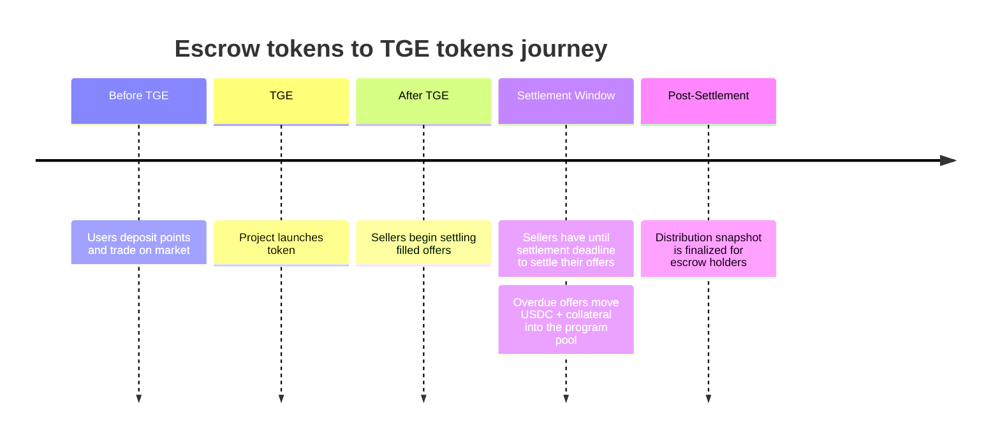

# Program Settlement

Settlement is the final step: converting escrow (`chXXX`) balances into the actual distributed
token allocation for a points program. For projects launching on a chain we do not natively settle
the tokens on, Checkpoint uses
[LayerZero v2](https://layerzero.network/) to coordinate distribution across chains seamlessly.

## What is Settlement?

Settlement is the process that happens after TGE (Token Generation Event) where:

1. The project token launches on one or more blockchains
2. Sellers settle filled offers, or overdue offers are pushed into default handling
3. Checkpoint snapshots a program-wide distribution
4. Escrow holders claim their pro-rata share of tokens, plus any pooled USDC from overdue offers

<Danger>Escrow tokens conversion is only one way and CANNOT be reversed.</Danger>

## The Timeline

```mermaid
  timeline title Escrow tokens to TGE tokens journey
  Before TGE : Users deposit points and trade on market
  TGE : Project launches token
  After TGE : Sellers begin settling filled offers
  Settlement Window : Sellers have until settlement deadline to settle their offers
                    : Overdue offers move USDC + collateral into the program pool
  Post-Settlement : Distribution snapshot is finalized for escrow holders
```

## Settlement

Settlement is **global per points program**, not a direct 1:1 or per-offer redemption flow.
`Settlement.sol` tracks a shared distribution snapshot for each `pointsId` containing:

- total token amount deposited for the program
- total USDC accumulated from overdue/defaulted offers
- total escrow supply at distribution time
- token ratio used for claims

Once the distribution is settled, claims are calculated pro-rata from that shared snapshot.

### Same-chain settlement

For programs launching on the same chain as `Settlement.sol`, users claim through
`claimDistribution(pointsId)`.

On claim:

1. The claimant transfers their escrow tokens into `Settlement.sol`
2. The contract calculates their token share from the program's `tokenRatio`
3. The contract also calculates their share of the pooled USDC from overdue/defaulted offers
4. Both amounts are sent to the claimant

Users can either claim directly or wait for any announced distribution process by Checkpoint.

<Info>Claims are based on your escrow balance relative to the full settlement snapshot for that program.</Info>

### Settlement on another chain

For projects launching on a different chain, users must interact with the `RemoteSettlement.sol`
contract on that relevant chain.

Checkpoint stores the program distribution snapshot on `Settlement.sol`. Anyone can then relay the
settlement data to the remote settlement contract with `sendSettlementMessage()`.

Just like with the same chain settlement, users can either claim the distribution directly via
`claimDistribution()` or they can wait for an airdrop to their wallet which will be announced by
Checkpoint well in advance if done so.

<Note>You will need to bridge the escrow tokens to the relevant chain before claiming.</Note>

## Defaulted and overdue offers

If a seller misses the settlement deadline, the market calls `depositCollateral()` with:

$$\text{filledAmount} + \text{collateralAmount}$$

Where:
- `filledAmount` is the purchase amount of the offer
- `collateralAmount` is the collateral amount in USDC provided by the seller, if applicable

That amount is added to the USDC pool for the entire points program. It is later redistributed
pro-rata to escrow holders during claims.
